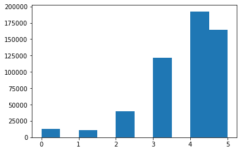
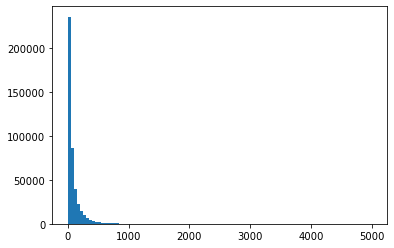
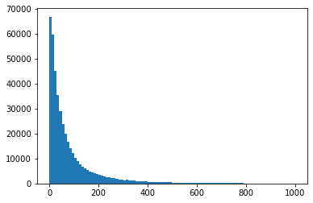
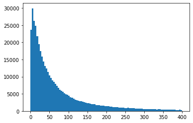
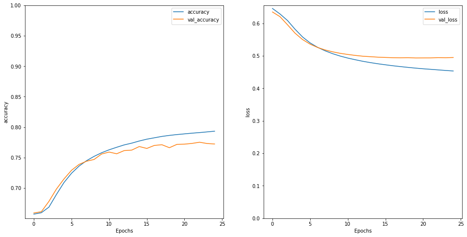

Shemika Dawson
Continuous Bag of Words
Neural Networks 


```python
import pandas as pd
import numpy as np
import gzip
import matplotlib.pyplot as plt
from sklearn.model_selection import train_test_split

def parse(path):
  g = gzip.open(path, 'rb')
  for l in g:
    yield eval(l)

def getDF(path):
  i = 0
  df = {}
  for d in parse(path):
    df[i] = d
    i += 1
  return pd.DataFrame.from_dict(df, orient='index')

df = getDF("goodreads_reviews_comics_graphic.json.gz")


```


```python
df.isna().sum()
```


    user_id         0
    book_id         0
    review_id       0
    rating          0
    review_text     0
    date_added      0
    date_updated    0
    read_at         0
    started_at      0
    n_votes         0
    n_comments      0
    dtype: int64


```python
del df['user_id']
del df['book_id']
del df['review_id']
del df['date_added']
del df['date_updated']
del df['read_at']
del df['started_at']
del df['n_votes']
del df['n_comments']
```


```python
any(not c.isalnum() for c in df)
```


    True


```python
getVals = list([val for val in df if val.isalnum()])
result = "".join(getVals)
```


```python
X, y = df['review_text'], df['rating']

```


```python
df.to_csv(r'C:\Users\dawso\Downloads\Comic.csv', index = False)
```


```python
np.random.seed(123)

from sklearn.metrics import roc_auc_score
from sklearn.manifold import TSNE

from keras.preprocessing.text import Tokenizer
from keras.preprocessing.sequence import pad_sequences
from tensorflow.keras.layers import LSTM, Conv1D, MaxPooling1D, Dropout
from keras.utils.np_utils import to_categorical

%matplotlib inline
```


```python
df.head()
```


<div>
<style scoped>
    .dataframe tbody tr th:only-of-type {
        vertical-align: middle;
    }

    .dataframe tbody tr th {
        vertical-align: top;
    }

    .dataframe thead th {
        text-align: right;
    }
</style>
<table border="1" class="dataframe">
  <thead>
    <tr style="text-align: right;">
      <th></th>
      <th>rating</th>
      <th>review_text</th>
    </tr>
  </thead>
  <tbody>
    <tr>
      <th>0</th>
      <td>3</td>
      <td>Sherlock Holmes and the Vampires of London \n ...</td>
    </tr>
    <tr>
      <th>1</th>
      <td>4</td>
      <td>I've never really liked Spider-Man. I am, howe...</td>
    </tr>
    <tr>
      <th>2</th>
      <td>4</td>
      <td>A very quick introduction, this is coming out ...</td>
    </tr>
    <tr>
      <th>3</th>
      <td>5</td>
      <td>I've been waiting so long for this. I first st...</td>
    </tr>
    <tr>
      <th>4</th>
      <td>4</td>
      <td>The only thing more entertaining than this boo...</td>
    </tr>
  </tbody>
</table>
</div>


```python
plt.hist(df['rating'])
```


    (array([ 12806.,      0.,  11063.,      0.,  39354.,      0., 121916.,
                 0., 192486., 164713.]),
     array([0. , 0.5, 1. , 1.5, 2. , 2.5, 3. , 3.5, 4. , 4.5, 5. ]),
     <BarContainer object of 10 artists>)


    

    


```python
df['target'] = df['rating']<4
```


```python
X_train, X_test, train_y, test_y = train_test_split(X, df['target'], test_size = .2)
```


```python
X_train.shape
```


    (433870,)


```python
X_test.shape
```


    (108468,)


```python
MAX_NB_WORDS = 30000
```


```python
x_trains = X_train.astype(str)
x_tests = X_test.astype(str)

tokenizer = Tokenizer(num_words=MAX_NB_WORDS, char_level=False)
tokenizer.fit_on_texts(x_trains)
sequences = tokenizer.texts_to_sequences(x_trains)
sequences_test = tokenizer.texts_to_sequences(x_tests)

word_index = tokenizer.word_index
print('Found %s unique tokens.' % len(word_index))
```

    Found 428820 unique tokens.
    


```python
sequences[0]
```


    [61,
     56,
     68,
     86,
     16775,
     18458,
     45,
     52,
     99,
     3,
     230,
     4,
     2002,
     14,
     235,
     2,
     1016,
     6,
     12,
     1122,
     172,
     64,
     428,
     6,
     2099,
     9,
     14,
     3,
     509,
     559,
     2399,
     23]


```python
type(tokenizer.word_index), len(tokenizer.word_index)
```


    (dict, 428820)


```python
index_to_word = dict((i,w) for w, i in tokenizer.word_index.items())
```


```python
" ".join([index_to_word[i] for i in sequences[0]])
```


    "very good graphic novel kelley otherworld series has been a favorite of mine for years and today i was reminded why i'm happy i chose this for a quick early morning read"


```python
seq_lens = [len(s) for s in sequences]
print("Average length: %0.1f" % np.mean(seq_lens))
print("Max length: %d" % max(seq_lens))
```

    Average length: 87.6
    Max length: 4999
    


```python
%matplotlib inline
plt.hist(seq_lens, bins=100);
```


    

    


```python
plt.hist([l for l in seq_lens if l < 1000], bins = 100);
```


    

    


```python
plt.hist([l for l in seq_lens if l < 400], bins = 100);
```


    

    


```python
MAX_SEQUENCE_LENGTH = 300

xtr = pad_sequences(sequences, maxlen=MAX_SEQUENCE_LENGTH)
xte = pad_sequences(sequences_test, maxlen=MAX_SEQUENCE_LENGTH)

print('Shape of data tensor:', xtr.shape)
print('Shape of data test tensor:', xte.shape)
```

    Shape of data tensor: (433870, 300)
    Shape of data test tensor: (108468, 300)
    


```python
xtr[0]
```


    array([    0,     0,     0,     0,     0,     0,     0,     0,     0,
               0,     0,     0,     0,     0,     0,     0,     0,     0,
               0,     0,     0,     0,     0,     0,     0,     0,     0,
               0,     0,     0,     0,     0,     0,     0,     0,     0,
               0,     0,     0,     0,     0,     0,     0,     0,     0,
               0,     0,     0,     0,     0,     0,     0,     0,     0,
               0,     0,     0,     0,     0,     0,     0,     0,     0,
               0,     0,     0,     0,     0,     0,     0,     0,     0,
               0,     0,     0,     0,     0,     0,     0,     0,     0,
               0,     0,     0,     0,     0,     0,     0,     0,     0,
               0,     0,     0,     0,     0,     0,     0,     0,     0,
               0,     0,     0,     0,     0,     0,     0,     0,     0,
               0,     0,     0,     0,     0,     0,     0,     0,     0,
               0,     0,     0,     0,     0,     0,     0,     0,     0,
               0,     0,     0,     0,     0,     0,     0,     0,     0,
               0,     0,     0,     0,     0,     0,     0,     0,     0,
               0,     0,     0,     0,     0,     0,     0,     0,     0,
               0,     0,     0,     0,     0,     0,     0,     0,     0,
               0,     0,     0,     0,     0,     0,     0,     0,     0,
               0,     0,     0,     0,     0,     0,     0,     0,     0,
               0,     0,     0,     0,     0,     0,     0,     0,     0,
               0,     0,     0,     0,     0,     0,     0,     0,     0,
               0,     0,     0,     0,     0,     0,     0,     0,     0,
               0,     0,     0,     0,     0,     0,     0,     0,     0,
               0,     0,     0,     0,     0,     0,     0,     0,     0,
               0,     0,     0,     0,     0,     0,     0,     0,     0,
               0,     0,     0,     0,     0,     0,     0,     0,     0,
               0,     0,     0,     0,     0,     0,     0,     0,     0,
               0,     0,     0,     0,     0,     0,     0,     0,     0,
               0,     0,     0,     0,     0,     0,     0,    61,    56,
              68,    86, 16775, 18458,    45,    52,    99,     3,   230,
               4,  2002,    14,   235,     2,  1016,     6,    12,  1122,
             172,    64,   428,     6,  2099,     9,    14,     3,   509,
             559,  2399,    23])


```python
xte[0]
```


    array([    0,     0,     0,     0,     0,     0,     0,     0,     0,
               0,     0,     0,     0,     0,     0,     0,     0,     0,
               0,     0,     0,     0,     0,     0,     0,     0,     0,
               0,     0,     0,     0,     0,     0,     0,     0,     0,
               0,     0,     0,     0,     0,     0,     0,     0,     0,
               0,     0,     0,     0,     0,     0,     0,     0,     0,
               0,     0,     0,     0,     0,     0,     0,     0,     0,
               0,     0,     0,     0,     0,     0,     0,     0,     0,
               0,     0,     0,     0,     0,     0,     0,     0,     0,
               0,     0,     0,     0,     0,     0,     0,     0,     0,
               0,     0,     0,     0,     0,     0,     0,     0,     0,
               0,     0,     0,     0,     0,     0,     0,     0,     0,
               0,     0,     0,     0,     0,     0,     0,     0,     0,
               0,     0,     0,     0,     0,     0,     0,     0,     0,
               0,     0,     0,     0,     0,     0,     0,     0,     0,
               0,     0,     0,     0,     0,     0,     0,     0,     0,
               0,     0,     0,     0,     0,     0,     0,     0,     0,
               0,     0,     0,     0,     0,     0,     0,     0,     0,
               0,     0,     0,     0,     0,     0,     0,     0,     0,
               0,     0,     0,     0,     0,     0,     0,     0,     0,
               0,     0,     0,     0,     0,     0,     0,     0,     0,
               0,     0,     0,     0,     0,     0,     0,     0,     0,
               0,     0,     0,     0,     0,     0,     0,     0,     0,
               0,     0,     0,     0,     0,     0,     0,     0,     0,
               0,     0,     0,     0,     0,     0,     0,     0,     0,
               0,     0,     0,     0,     0,     0,     0,     0,     0,
               0,     0,     0,     0,     0,     0,     0,     0,     0,
               0,     0,     0,     0,     0,     0,     0,     0,     0,
              58,    10,    19,    60,   542,  5066,  1100, 16498, 16498,
            3330,  3781,  6057, 16498, 16498,  2074,  2074,  3781, 13411,
           13411, 15284,  1474,   971,   517,  1967,   517,   971,  4449,
            3081,  5111, 26069,  9216,  4540,  1155,  8934, 20369,  1047,
            4523, 20369, 12823,   570,   247,  6043,   288, 19239,  2771,
            1220, 20542, 20802])


```python
y_train = train_y
y_test = test_y

y_train = to_categorical(np.asarray(y_train))
print('Shape of label tensor:', y_train.shape)
```

    Shape of label tensor: (433870, 2)
    


```python
from keras.layers import Dense, Input, Flatten
from keras.layers import GlobalAveragePooling1D, Embedding
from keras.models import Model

EMBEDDING_DIM = 100
N_CLASSES = 2

seq_in = Input(shape=(MAX_SEQUENCE_LENGTH,), dtype='int32')

em_layer = Embedding(MAX_NB_WORDS, EMBEDDING_DIM,
                           input_length=MAX_SEQUENCE_LENGTH,
                           trainable=True)
em_seq = em_layer(seq_in)

ave = GlobalAveragePooling1D()(em_seq)
pred = Dense(N_CLASSES, activation='softmax')(ave)

mod = Model(seq_in, pred)
mod.compile(loss='categorical_crossentropy',
           optimizer='adam', metrics=['accuracy'])
```


```python
from keras.callbacks import EarlyStopping

es = EarlyStopping(monitor='val_loss', mode='min', verbose=1, patience = 5)
```


```python
model = mod.fit(xtr, y_train, validation_split=0.20,
       epochs = 100, batch_size = 4050, callbacks=[es])
```

    Epoch 1/100
    86/86 [==============================] - 115s 919ms/step - loss: 0.6587 - accuracy: 0.6498 - val_loss: 0.6352 - val_accuracy: 0.6589
    Epoch 2/100
    86/86 [==============================] - 77s 897ms/step - loss: 0.6321 - accuracy: 0.6595 - val_loss: 0.6207 - val_accuracy: 0.6610
    Epoch 3/100
    86/86 [==============================] - 80s 933ms/step - loss: 0.6158 - accuracy: 0.6634 - val_loss: 0.5957 - val_accuracy: 0.6779
    Epoch 4/100
    86/86 [==============================] - 73s 849ms/step - loss: 0.5884 - accuracy: 0.6842 - val_loss: 0.5699 - val_accuracy: 0.6982
    Epoch 5/100
    86/86 [==============================] - 76s 887ms/step - loss: 0.5635 - accuracy: 0.7039 - val_loss: 0.5502 - val_accuracy: 0.7148
    Epoch 6/100
    86/86 [==============================] - 75s 867ms/step - loss: 0.5429 - accuracy: 0.7212 - val_loss: 0.5361 - val_accuracy: 0.7290
    Epoch 7/100
    86/86 [==============================] - 74s 858ms/step - loss: 0.5289 - accuracy: 0.7338 - val_loss: 0.5259 - val_accuracy: 0.7387
    Epoch 8/100
    86/86 [==============================] - 77s 901ms/step - loss: 0.5184 - accuracy: 0.7430 - val_loss: 0.5182 - val_accuracy: 0.7440
    Epoch 9/100
    86/86 [==============================] - 74s 865ms/step - loss: 0.5085 - accuracy: 0.7510 - val_loss: 0.5125 - val_accuracy: 0.7468
    Epoch 10/100
    86/86 [==============================] - 74s 855ms/step - loss: 0.5009 - accuracy: 0.7563 - val_loss: 0.5078 - val_accuracy: 0.7558
    Epoch 11/100
    86/86 [==============================] - 74s 862ms/step - loss: 0.4932 - accuracy: 0.7629 - val_loss: 0.5044 - val_accuracy: 0.7590
    Epoch 12/100
    86/86 [==============================] - 76s 889ms/step - loss: 0.4884 - accuracy: 0.7668 - val_loss: 0.5015 - val_accuracy: 0.7562
    Epoch 13/100
    86/86 [==============================] - 74s 864ms/step - loss: 0.4843 - accuracy: 0.7692 - val_loss: 0.4990 - val_accuracy: 0.7614
    Epoch 14/100
    86/86 [==============================] - 75s 869ms/step - loss: 0.4791 - accuracy: 0.7736 - val_loss: 0.4975 - val_accuracy: 0.7622
    Epoch 15/100
    86/86 [==============================] - 75s 868ms/step - loss: 0.4762 - accuracy: 0.7766 - val_loss: 0.4961 - val_accuracy: 0.7681
    Epoch 16/100
    86/86 [==============================] - 76s 882ms/step - loss: 0.4730 - accuracy: 0.7794 - val_loss: 0.4952 - val_accuracy: 0.7650
    Epoch 17/100
    86/86 [==============================] - 76s 887ms/step - loss: 0.4694 - accuracy: 0.7815 - val_loss: 0.4944 - val_accuracy: 0.7699
    Epoch 18/100
    86/86 [==============================] - 75s 871ms/step - loss: 0.4665 - accuracy: 0.7850 - val_loss: 0.4941 - val_accuracy: 0.7711
    Epoch 19/100
    86/86 [==============================] - 75s 868ms/step - loss: 0.4652 - accuracy: 0.7858 - val_loss: 0.4945 - val_accuracy: 0.7662
    Epoch 20/100
    86/86 [==============================] - 75s 870ms/step - loss: 0.4635 - accuracy: 0.7878 - val_loss: 0.4936 - val_accuracy: 0.7717
    Epoch 21/100
    86/86 [==============================] - 75s 871ms/step - loss: 0.4602 - accuracy: 0.7887 - val_loss: 0.4937 - val_accuracy: 0.7720
    Epoch 22/100
    86/86 [==============================] - 75s 867ms/step - loss: 0.4585 - accuracy: 0.7895 - val_loss: 0.4938 - val_accuracy: 0.7732
    Epoch 23/100
    86/86 [==============================] - 78s 903ms/step - loss: 0.4562 - accuracy: 0.7921 - val_loss: 0.4947 - val_accuracy: 0.7752
    Epoch 24/100
    86/86 [==============================] - 75s 877ms/step - loss: 0.4555 - accuracy: 0.7914 - val_loss: 0.4944 - val_accuracy: 0.7730
    Epoch 25/100
    86/86 [==============================] - 75s 870ms/step - loss: 0.4526 - accuracy: 0.7944 - val_loss: 0.4950 - val_accuracy: 0.7723
    Epoch 00025: early stopping
    


```python
out_test = mod.predict(xte)
print("Test AUC:", roc_auc_score(y_test, out_test[:,1]))

```

    Test AUC: 0.8199559069515974
    


```python
def plot_graphs(model, metric):
  plt.plot(model.history[metric])
  plt.plot(model.history['val_'+metric], '')
  plt.xlabel("Epochs")
  plt.ylabel(metric)
  plt.legend([metric, 'val_'+metric])
```


```python
plt.figure(figsize=(16, 8))
plt.subplot(1, 2, 1)
plot_graphs(model, 'accuracy')
plt.ylim(None, 1)
plt.subplot(1, 2, 2)
plot_graphs(model, 'loss')
plt.ylim(0, None)
```


    (0.0, 0.6555980578064918)


    

    


```python

```
